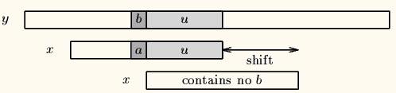
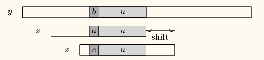
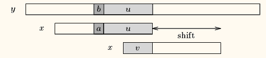
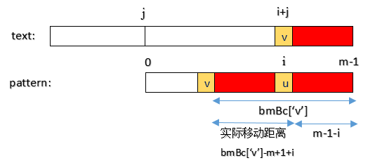
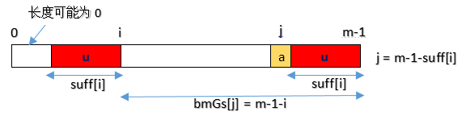
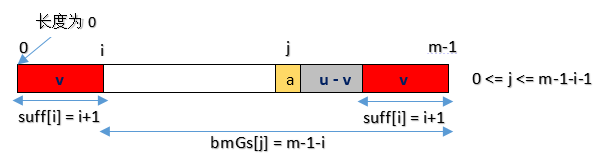
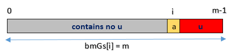

## BM 算法理论探讨

- 坏字符算法

当出现一个坏字符时, BM算法向右移动模式串, 让模式串中最靠右的对应字符与坏字符相对, 然后继续匹配.

Case1: 模式串中有对应的坏字符时, 让模式串中最靠右的对应字符与坏字符相对.


Case2: 模式串中不存在坏字符, 很好, 直接右移整个模式串长度的步数




- 好后缀算法

如果程序匹配了一个好后缀, 并且在模式中还有另外一个相同的后缀或者后缀的部分, 那把下一个后缀或部分移动到当前后缀位置.

假如说, pattern的后u个字符和text都已经匹配, 但是接下来一个字符串不匹配, 我需要移动才能匹配. 

如果说后u个字符在pattern其他位置也出现过或部分出现, 我们将pattern右移到前面的u个字符或部分和最后u个字符或部分相同;

如果说后u个字符在pattern其他位置完全没有出现, 很好, 直接右移整个pattern.


Case1: 模式串中有子串和好后缀完全匹配, 则将最靠右的那个子串移动到好后缀的位置继续进行匹配.



Case2: 如果不存在和好后缀完全匹配的子串, 则在好后缀中找到具有如下特征的最长子串, 使得`p[m-s...m]=p[0...s]`




Case3: 如果完全不存在和好后缀匹配的子串, 则右移整个模式串.


## BM 算法

- 计算坏字符数组 bmBc

```
Case1: 字符串在模式中有出现,  bmBc['v'] 表示字符 'v' 在模式串中最后一次出现的位置, 距离模式串串尾的长度
Case2: 字符串在模式串没有出现, 即模式串中没有字符 'v', 则bmdad['v'] = len(pattern) 

var bmBc = make([]int, 256)
var length = len(pattern)
for i := 0; i < 256; i++ {
    bmBc[i] = length
}
for i := 0; i < length-1; i++ {
    bmBc[pattern[i]] = length - 1 - i
}
```


计算pattern需要右移的距离, 要借助bmBc数组, 那么bmBc的值是不是就是pattern实际要右移的距离呢? 

No,想想也不是,比如前面举例说到利用bmBc算法还可能走回头路,也就是右移的距离是负数, 而bmBc的值绝对不可能是负数, 所以两者不相等.

那么pattern实际右移的距离怎么算呢? 这个就要看text中坏字符的位置了, 前面说过坏字符算法是针对text的, 如下图,
图中v是text中的坏字符 (对应位置i+j), 在pattern中对应不匹配的位置为i, 那么pattern实际要右移的距离就是: `bmBc['v'] - m + 1 + i`




- 计算好后缀数组bmGs

这里的bmGs的下标是数字而不是字符, 表示字符在pattern中位置.

bmGs数组计算分三种情况, 与前一一对应, 假设图中好后缀长度用数组suff表示

Case1: 好后缀算法case1, 如下图, j是好后缀之前的那个位置.




Case2: 对应好后缀算法case2




Case3: 对应好后缀算法case3, `bmGs[i] = len(pattern)` 



```
var bmGs = make([]int, len(pattern))
var length = len(pattern)

// 全部赋值为 length, 包括了Case3
for i := 0; i < length; i++ {
    bmGs[i] = length
}

// Case2
j := 0
for i := length - 1; i >= 0; i-- {
    if suffix[i] == i+1 {
        for ; j <= length-1-i-1; j++ {
            if bmGs[j] == length {
                bmGs[j] = length - 1 - i
            }
        }
    }
}

// Case1
for i := 0; i <= length-2; i++ {
    bmGs[length-1-suffix[i]] = length - 1 - i
}
```

- 关于suffix的定义

suff数组的定义: m是pattern的长度

```
a. suffix[m-1] = m;

b. suffix[i] = k  
    for [ pattern[i-k+1] ..., pattern[i]] == [pattern[m-1-k+1], ..., pattern[m-1]]
```

即: suffix表示以位置i结尾字符串和pattern字符串的公共后缀的长度.

```
m := length(pattern)
suffix = make([]int, length)

suffix[m-1] = m

for i:=m-2; i>=0; i-- {
    j := i
    for j>=0 && pattern[j] == pattern[length-1-i+j]
       j--
    suffix[i] = i-j
}
```
