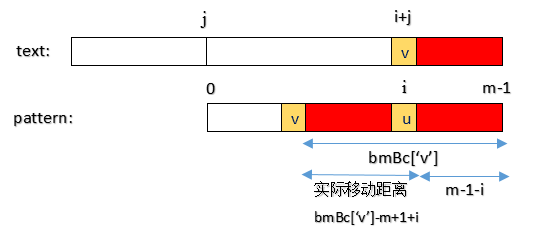

## BM 算法理论探讨

- 坏字符算法

当出现一个坏字符时, BM算法向右移动模式串, 让模式串中最靠右的对应字符与坏字符相对, 然后继续匹配.

Case1: 模式串中有对应的坏字符时, 让模式串中最靠右的对应字符与坏字符相对.


Case2: 模式串中不存在坏字符, 很好, 直接右移整个模式串长度的步数


- 好后缀算法

如果程序匹配了一个好后缀, 并且在模式中还有另外一个相同的后缀或者后缀的部分, 那把下一个后缀或部分移动到当前后缀位置.

假如说, pattern的后u个字符和text都已经匹配, 但是接下来一个字符串不匹配, 我需要移动才能匹配. 

如果说后u个字符在pattern其他位置也出现过或部分出现, 我们将pattern右移到前面的u个字符或部分和最后u个字符或部分相同;

如果说后u个字符在pattern其他位置完全没有出现, 很好, 直接右移整个pattern.


Case1: 模式串中有子串和好后缀完全匹配, 则将最靠右的那个子串移动到好后缀的位置继续进行匹配.


Case2: 如果不存在和好后缀完全匹配的子串, 则在好后缀中找到具有如下特征的最长子串, 使得`p[m-s...m]=p[0...s]`


Case3: 如果完全不存在和好后缀匹配的子串, 则右移整个模式串.


## BM 算法

- 计算坏字符数组 bmBc

```
Case1: 字符串在模式中有出现,  bmBc['v'] 表示字符 'v' 在模式串中最后一次出现的位置, 距离模式串串尾的长度
Case2: 字符串在模式串没有出现, 即模式串中没有字符 'v', 则bmdad['v'] = len(pattern) 

var bmBc = make([]int, 256)
var length = len(pattern)
for i := 0; i < 256; i++ {
    bmBc[i] = length
}
for i := 0; i < length-1; i++ {
    bmBc[pattern[i]] = length - 1 - i
}
```


计算pattern需要右移的距离, 要借助bmBc数组, 那么bmBc的值是不是就是pattern实际要右移的距离呢? 

No,想想也不是,比如前面举例说到利用bmBc算法还可能走回头路,也就是右移的距离是负数, 而bmBc的值绝对不可能是负数, 所以两者不相等.

那么pattern实际右移的距离怎么算呢? 这个就要看text中坏字符的位置了, 前面说过坏字符算法是针对text的, 如下图,
图中v是text中的坏字符 (对应位置i+j), 在pattern中对应不匹配的位置为i, 那么pattern实际要右移的距离就是: `bmBc['v'] - m + 1 + i`




- 计算好后缀数组bmGs

这里的bmGs的下标是数字而不是字符, 表示字符在pattern中位置.

bmGs数组计算分三种情况, 与前一一对应, 假设图中好后缀长度用数组suff表示

Case1: 好后缀算法case1, 如下图, j是好后缀之前的那个位置.


Case2: 对应好后缀算法case2


Case3: 对应好后缀算法case3, `bmGs[i] = len(pattern)` 


```

```